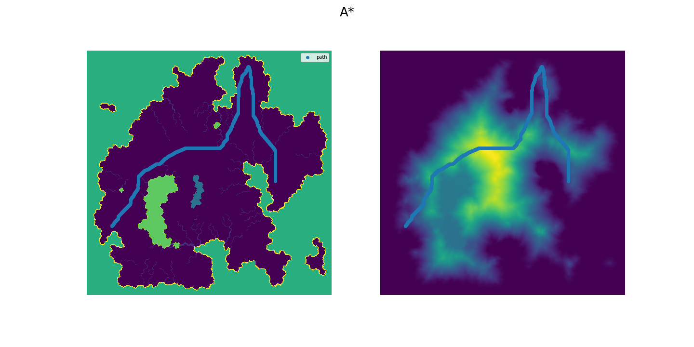

# path_planning

## Introduction

This project contains two algorithms for planning the quickest path for a rover to pick up a bachelor and carry him to his wedding. Shortest path problems are typically solved bij [Dijkstra](https://en.wikipedia.org/wiki/Dijkstra%27s_algorithm) and it's improved version [A*](https://en.wikipedia.org/wiki/A*_search_algorithm). Follow the instructions below to run find your quickest path. 




## Instructions

```bash
cmake --build .                                   # Builds an executable
./Bachelor                                        # Finds the path
``` 
