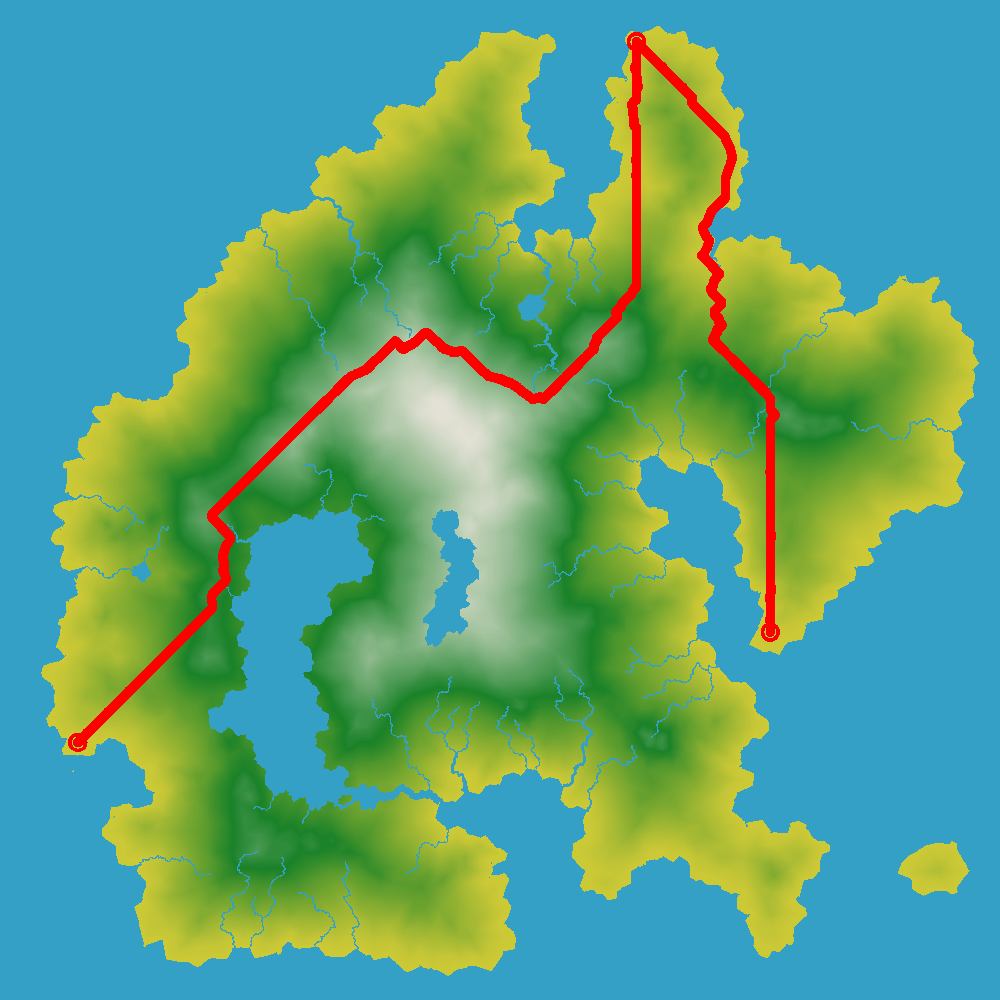
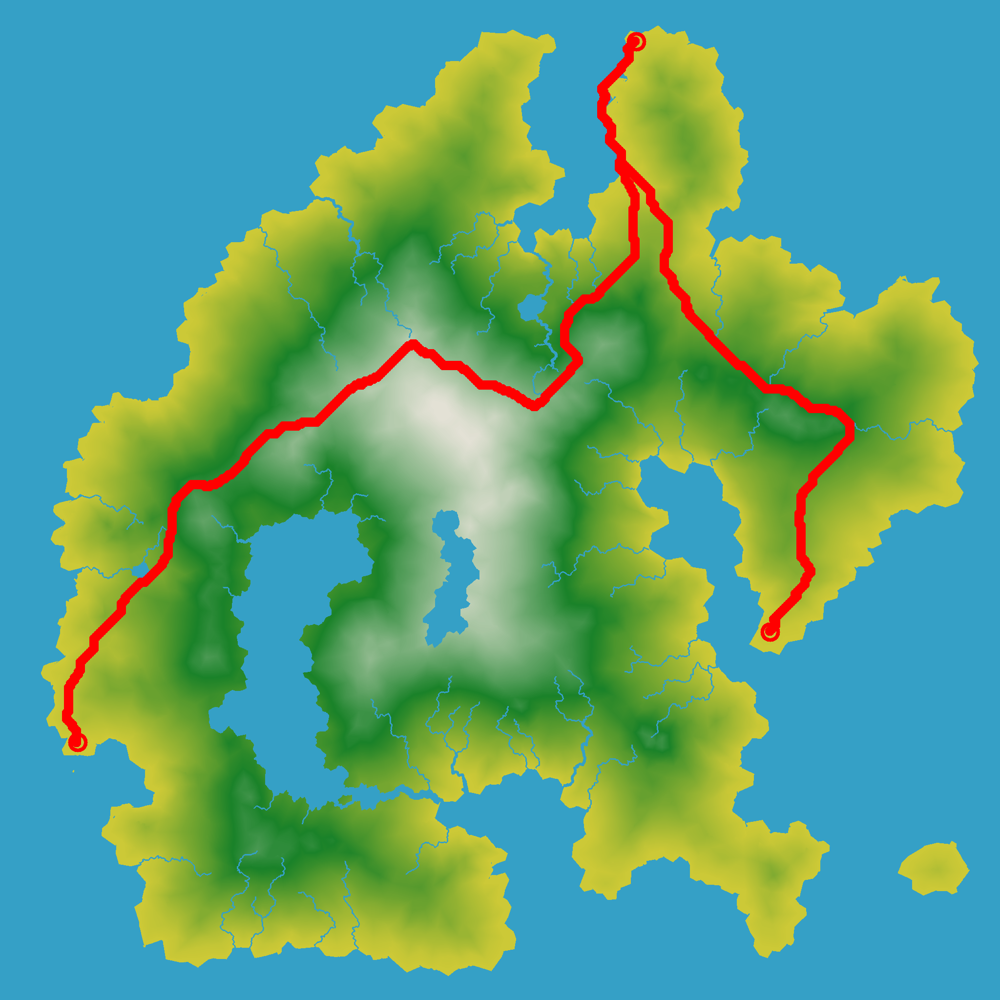

# path_planning

## Introduction

This project contains two algorithms for planning the quickest path for a rover to pick up a bachelor and carry him to his wedding. Shortest path problems are typically solved by [Dijkstra](https://en.wikipedia.org/wiki/Dijkstra%27s_algorithm) and it's improved version [A\*](https://en.wikipedia.org/wiki/A*_search_algorithm). Follow the instructions below to run find your quickest path. 

The picture below shows three locations: Rover (left lower), Bachelor (middle top) and the wedding (right lower).


## Algorithm choice
While Breadth First Search explores equally in all directions, Dijkstra’s Algorithm prioritizes which paths to explore. Instead of exploring all possible paths equally, it favors lower cost paths. We can assign lower costs to encourage moving on land and flat areas and higher costs to avoid hills. When movement costs vary, we use this instead of Breadth First Search. The picture below shows the path planned by Dijkstra.


A\* is a modification of Dijkstra’s Algorithm that is optimized for a single destination. Dijkstra’s Algorithm can find paths to all locations; A\* finds paths to one location, or the closest of several locations. It prioritizes paths that seem to be leading closer to a goal. The picture below shows the path planned by A\*.



In the table below we compare both algorithms. The ultimate goal is to plan the shortest path. However, if the rover would require a very long planning time, it would still reach his destination very late. 

|                     | Dijkstra | A\* |
|---------------------|----------|--------|
| Path duration [s]   | 1332     | 1380   |
| Path length [cells] | 1517     | 1451   |
| Planning time [s]   | 599955   | 1239644 |

We see that A\* requires a longer planning time, while being optimized for reducing computation time! This is because A\* favours locations closer to the goal. Since the map contains a lot of rivers, a lot of locations that are closer to the goal are worse, because these will result in a longer path. 

## Instructions

```bash
mkdir build                                       # Make a build folder
cd build
cmake ..                                          # Link
make                                              # Build
./Bachelor                                        # Execute
``` 
## Code overview
The project contains the following structure:

    ├── main.cpp                    # Loads data from assets and passes in to planner
    ├── visualizer                  # Visualizes data
    │   ├── visualizer.cpp           
    │   └── include                 
    ├── implementation               
    |    ├── implementation.cpp     # The implementation of algorithm, graph and robot.
    |    └── include               
    |        ├── planner.h          # The interface with the main
    |        └── implementation.h               
    └── assets                      # The data
    

### Planner 
The planner is the interface with the main function and seperates the path search from the visualization. We want the program to run our algorithm of choice and evaluate the results, so the planner starts a query and returns a path. The main receves the result and uses the visualizer to also show the path on the island.

### Implementation
There are three basic components to finding the shortest path: A graph structure, a model and an agorithm. 

A **graph** is a data structure that can tell me the neighbors for each graph location. The weighted graph can also tell me the cost of moving along an edge, so it contains the elevation and overrides data. The overrides data is a hashset, because it only needs to store the locations that are non-traversable. The elevation is a hashmap, because this information also needs to store the cost (0..255) for each location.

Whereas the Dijkstra **algorithm** searches in each direction, A* adds an additional cost term to guide the search in the direction of the optimal path. This term is called a heuristic, which is often computed by a simple method. For instance, we know that the path should go in the direction of the goal, so we can simply calculate the distance to the goal from each next location. If we need to choose a next location, we take the one that is closer to the goal.

The simple **rover** is characterized by its velocity, which is 1 cell/s for traveling straight and sqrt(2) cell/s for traveling diagonally. The distance increases with altitude, so traveling up- or downwards is automatically more expensive. For instance, traveling straight in xy-direction and with an elevation of 1 in z-direction increases the distance to sqrt(1 + 1). 

Moving downwards decreases the path time and upwards increases it. We can model this by changing the time with some X %. However, travelling upwards and downwards, may not be equally as coslty as on flat areas, so upwards should increase the time with some extra percentage.

Below we see the path planned with a small car (top picture) and a heavy car (bottom picture). The more "weight" the car has, the bigger the difference between going up vs going down for the path time. So a heavy car tries to avoid the hills more than a smaller car. 




### Improvements
- The planner could be implemented with a Builder pattern. An algorithm (Dijktra or A*) receives a type of graph (grid or weighted grid) and a model (small or big). 
- The rule of five sais that every class requires a user-defined destructor, a user-defined copy constructor, or a user-defined copy assignment operator and move constructor. I did not implement the move and copy constructors, because for this small project, only 1 planner will be used. 
- The algorithm now receives a raw pointer and the planner's destructor deletes it, but a more safer solution would be that it receives a smart pointer, so memory is automatically managed. 


