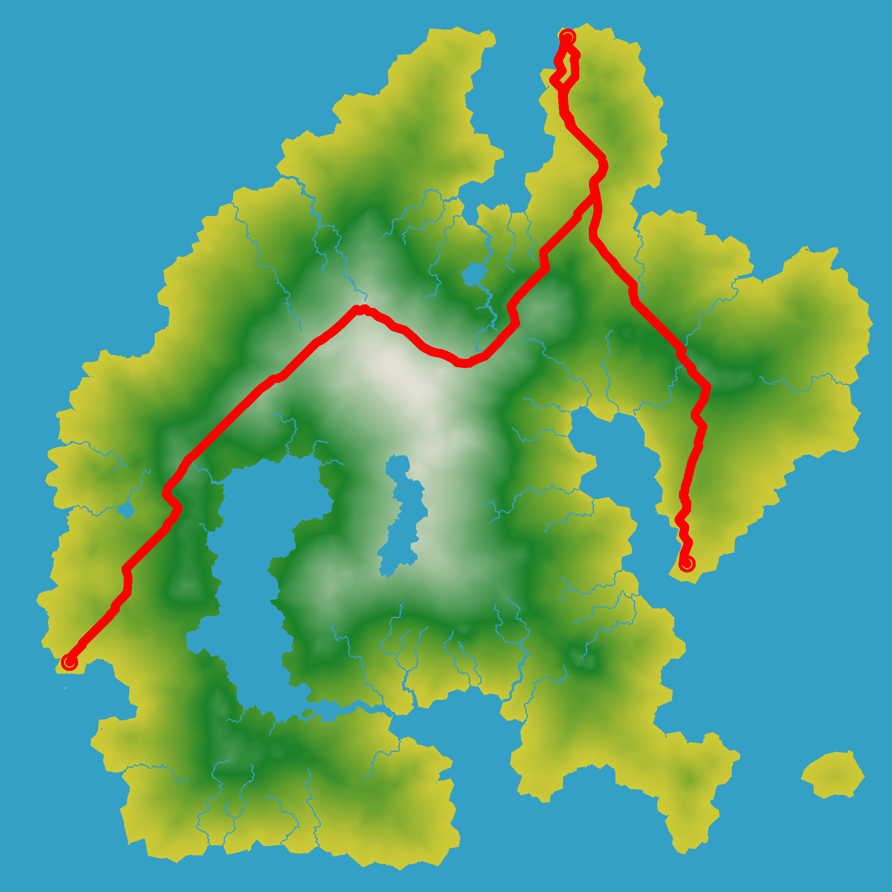

# path_planning

## Introduction

This project contains two algorithms for planning the quickest path for a rover to pick up a bachelor and carry him to his wedding. Shortest path problems are typically solved bij [Dijkstra](https://en.wikipedia.org/wiki/Dijkstra%27s_algorithm) and it's improved version [A*](https://en.wikipedia.org/wiki/A*_search_algorithm). Follow the instructions below to run find your quickest path for a small or heavy rover. 




### Dijkstra with small rover
The duration of the path is almost equal to the path length, as the velocity of the rover does not change much when traveling up- or downwards. 


### Dijkstra with big rover
The duration of the path is now bigger than the path length. We also see that the algorithm has found an alternative route, since it is more expensive to travel upwards. 
 


### A* with big rover
We see that the calculation time is quite large and the bachelor may miss his wedding, not because the rover is too slow, but because its algorithm has problem finding a short path. Can we do better?


## Instructions

```bash
cmake .                                           # Cache 
cmake --build . --target all                      # Build and gen executable
./Bachelor                                        # Finds the path
``` 
```bash
mkdir build                                       
cd build
cmake ..                                          # Build and gen executable
make
./Bachelor                                        # Finds the path
``` 
## Implemenation
### Rover model
The simple rover is characterized by its velocity, which is 1 cell/s for traveling straight and sqrt(2) cell/s for traveling diagonally. The distance increases with altitude, so traveling up- or downwards is automatically more expensive. For instance, traveling straight in xy-direction and with an elevation of 1 in z-direction increases the distance to sqrt(1 + 1). If we want to make sure that travelling diagonally in xy-direction is different from traveling straight and up- or downwards (avoiding those steep hills), we have to add mass. In code, we simplify this by a factor (e.a. factor=1.05) to multiply with the distance. However, the factor should be different for moving up- and downwards (e.a. factorUp=1.05, factorDown=.97) as moving down would increase the speed. Note that we decrease the speed with 5% for moving upwards (duration increases) and increase the speed with only 3% (reduce duration), because otherwise we do not avoid those hills. 

### Heuristics
Whereas the Dijkstra algorithm searches in each direction, A* adds an additional cost term to guide the search in the direction of the optimal path. This term is called a heuristic, which is often computed by a simple method. For instance, we know that the path should go in the direction of the goal, so we can simply calculate the distance to the goal from each next location. If we need to choose a next location, we take the one that is closer to the goal.

### Code 
The program should not take up too much *computation time*. This is why, I added a thread for each search query (from rover to bachelor and from bachelor to wedding). Also, I downscaled the grid.

We want the program to run our algorithm and car of *choice* and evaluate or *log* its results. 

If someone else or I would want to work on the code, it should be *understandandable*. For this reason, ... If someone else wants to use it, he/she might have methods with same names, so in order to avoid these naming conflicts, I defined namespace implementation.  
